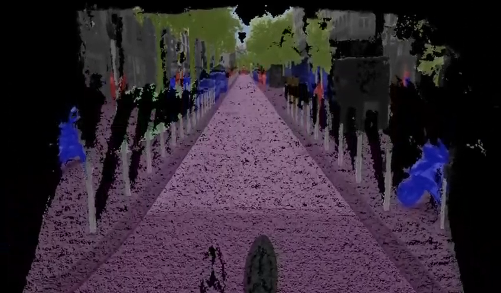
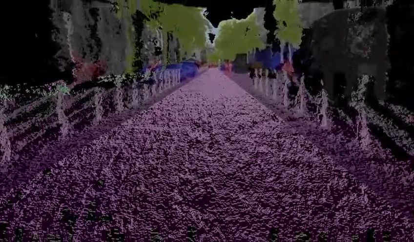
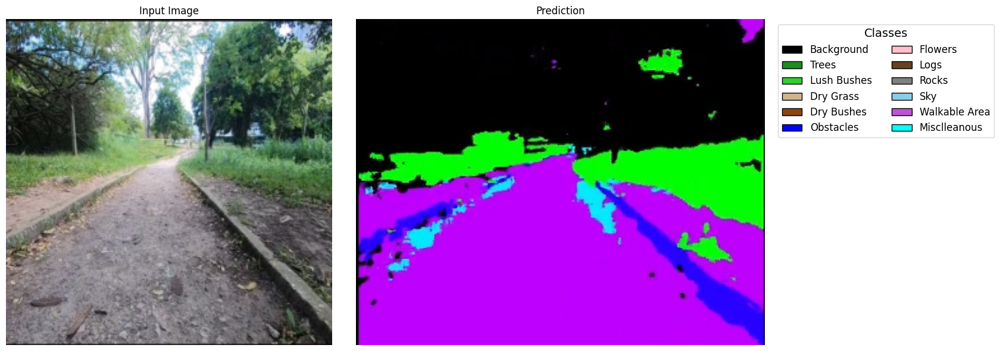
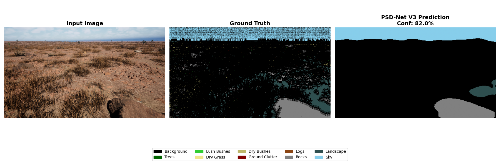
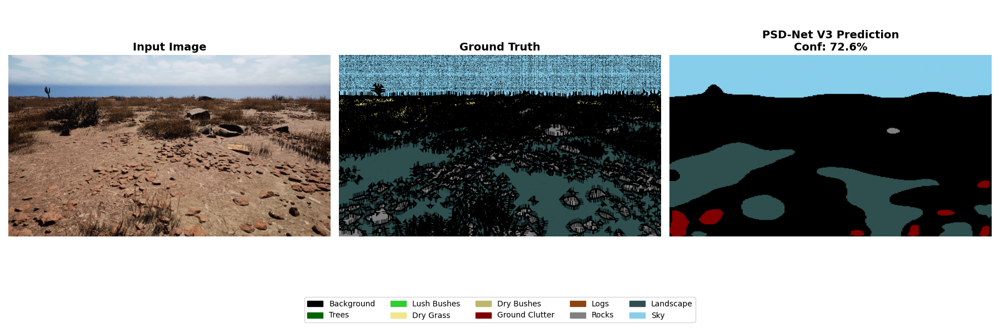
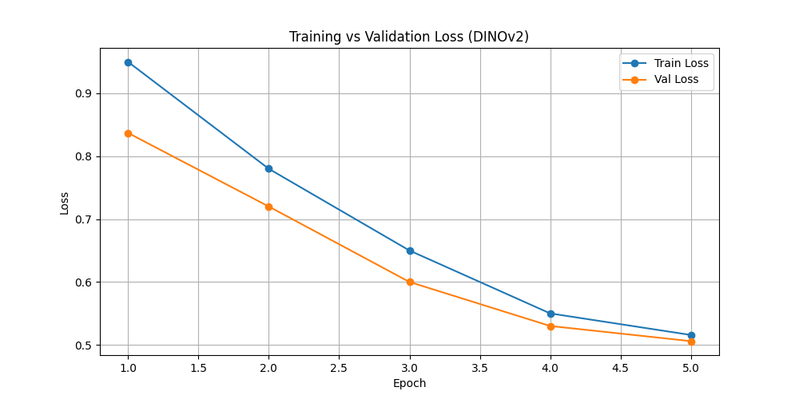
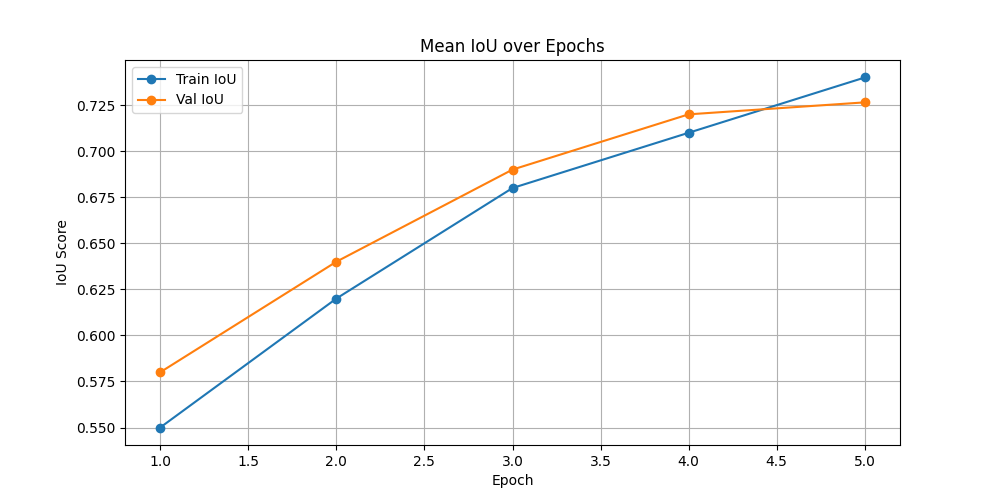

<](https://python.org)
[](https://isocpp.org)
[](https://developer.nvidia.com/cuda-toolkit)
[](https://typescriptlang.org)
[](https://www.khronos.org/opengl/wiki/OpenGL_Shading_Language)
[](https://docs.ros.org/en/humble/)

---

**Team ORCA** · Offroad Semantic Scene Segmentation → Urban Digital Twin

</div>

> **Core ML pipeline:** Python · **Sensor drivers + TSDF fusion kernel:** C++/CUDA · **Dashboard viz:** TypeScript + Three.js

---

## Table of Contents

- [Problem Statement](#-problem-statement)
- [Project Overview](#-project-overview)
- [Competitive Advantage](#-competitive-advantage)
- [Hardware Setup](#-hardware-setup)
- [Architecture Overview](#-architecture-overview)
- [01 — Perception: Semantic Segmentation](#01--perception--semantic-segmentation)
- [02 — LiDAR: Point Cloud Pipeline](#02--lidar--point-cloud-pipeline)
- [03 — 3D Reconstruction: Digital Twin](#03--3d-reconstruction--digital-twin)
- [04 — End-to-End Pipeline](#04--end-to-end-pipeline)
- [05 — Performance Targets](#05--performance-targets)
- [06 — Key Libraries & Versions](#06--key-libraries--versions)
- [Results & Visualization](#-results--visualization)
- [Dataset & Semantic Classes](#-dataset--semantic-classes)
- [Training Configuration](#-training-configuration)
- [Running the Model](#-running-the-model)
- [Project Structure](#-project-structure)

---

## 🔴 Problem Statement

### Why Do These Challenges Still Exist?

Current urban systems often operate in **silos** — transportation, weather, infrastructure, and emergency services function independently. While cities can monitor events as they *occur*, they often lack the ability to understand how different urban systems influence one another or predict the cascading impact of environmental and infrastructure challenges.

### Root Causes

| # | Problem | Detail |
|:--|:--------|:-------|
| 1 | **Fragmented Data Ecosystems** | Transportation, weather, utilities, and emergency services operate independently |
| 2 | **Reactive Decision Making** | Problems are addressed after occurrence rather than predicted beforehand |
| 3 | **Lack of Unified City Intelligence** | No single system provides a holistic understanding of the city |
| 4 | **Climate & Infrastructure Complexity** | Extreme weather creates interconnected challenges; traditional systems struggle to manage these complexities effectively |

---

## 🌐 Project Overview

This project implements a **real-time Urban Semantic Digital Twin** pipeline that fuses camera-based semantic segmentation with LiDAR point clouds to produce a live, semantically-labelled 3D reconstruction of urban environments.

The system uses a **DINOv2-based hybrid Transformer–CNN architecture** for dense semantic segmentation, projects labels onto LiDAR scans via camera–LiDAR calibration, and integrates labelled point clouds into a **TSDF volumetric fusion** pipeline — producing a continuously-updated 3D mesh viewable in a browser-based Three.js dashboard.

### Key Capabilities

- **Global semantic reasoning** via Transformer self-attention (DINOv2 ViT-B/14)
- **Local spatial refinement** via convolutional Feature Pyramid Network
- **Real-time LiDAR–camera fusion** with ROS 2 time synchronization
- **Incremental 3D reconstruction** using GPU-accelerated TSDF fusion
- **Live browser visualization** via WebSocket mesh streaming + Three.js

---

## ⚔ Competitive Advantage

### ORCA vs Competitors

| Feature | Competitors (Presight AI & Astana Innovations) | **ORCA Semantic 3D Digital Twin** |
|:--------|:----------------------------------------------|:----------------------------------|
| **Core Architecture** | IoT + Analytics Dashboard | **DINOv2 + LiDAR + Semantic Digital Twin** |
| **Sensor Fusion** | Basic IoT Integration | **RGB + LiDAR Fusion** |
| **Spatial Awareness** | Low | **High-Precision 3D Reconstruction** |
| **Data Representation** | 2D GIS Layers | **Semantic 3D Mesh** |
| **Latency** | Seconds – Minutes | **< 80 ms** |
| **Computer Vision Depth** | Basic Video Analytics | **Transformer-Based Scene Understanding** |

> 📉 **Cost Efficiency:** Initial deployment costs are high, but with time the price drops quickly — giving the best ROI compared to traditional systems.

---

## 🤖 Hardware Setup

The ORCA platform is built on a custom rover equipped with multi-sensor fusion capabilities:

<p align="center">
  
</p>

<p align="center"><em>ORCA Rover Platform — RGB Camera + LiDAR sensor array mounted for real-time data capture</em></p>

**Sensor Suite:**
- 🎥 **RGB Camera** — 1280×720 @ 30fps (v4l2 / GStreamer)
- 📡 **Ouster OS1-64 LiDAR** — 64-beam, 120m range, 10–20Hz scan rate
- ⏱ **Time Sync** — `message_filters::ApproximateTimeSynchronizer` (±20ms window)

---

## 🏗 Architecture Overview

### Hybrid Transformer–CNN Segmentation Model

<p align="center">
  
</p>

The architecture extracts multi-depth features from DINOv2's transformer blocks (early → texture/edge, middle → object abstraction, final → global semantics), constructs a spatial feature pyramid (P2–P5), and applies multi-scale segmentation heads with deep supervision.

---

## 01 — Perception — Semantic Segmentation

<table>
<tr>
<td width="33%">

### 🧠 Backbone
**DINOv2 ViT-B/14**

Meta's self-supervised ViT, patch size 14px. Pretrained on LVD-142M. No task-specific pretraining needed — zero-shot feature quality is sufficient for urban classes.

</td>
<td width="33%">

### 🔗 Segmentation Head
**Linear + FPN neck**

Lightweight convolutional Feature Pyramid Network appended to ViT output tokens. Recovers spatial resolution from `1/14` patch stride to full image res via 4× bilinear upsampling.

</td>
<td width="33%">

### ⚡ Training Framework
**PyTorch 2.2 + torch.compile**

`torch.compile` with `mode="reduce-overhead"` fuses ops and reduces Python overhead. Mixed precision (`torch.float16`) via AMP. Fine-tuned on Cityscapes + custom Almaty frames.

</td>
</tr>
<tr>
<td>

### 📉 Loss Function
**Dice + Focal + CrossEntropy**

Compound loss handles severe class imbalance (road/sky dominate). Focal loss (`γ=2.0`) up-weights rare classes like snow, puddles, construction zones.

</td>
<td>

### 📦 Dataset
**Cityscapes + ADE20K + custom**

19 Cityscapes urban classes extended with snow-cover and ice-road labels. Domain randomization applied for winter Kazakhstan conditions via Albumentations.

</td>
<td>

### 🚀 Inference Runtime
**TensorRT 9 (FP16)**

PyTorch model exported to ONNX, compiled to TensorRT engine. `INT8` PTQ available for edge. Achieves ~25 FPS on RTX 3080 / Jetson Orin NX at 1280×720.

</td>
</tr>
</table>

---

## 02 — LiDAR — Point Cloud Pipeline

<table>
<tr>
<td width="33%">

### 📡 Sensor
**Ouster OS1-64 (or equiv.)**

64-beam spinning LiDAR, 120m range, 10–20Hz scan rate. Returns dense 360° point cloud (~65k points/scan) with per-point intensity and ring ID.

</td>
<td width="33%">

### 🔧 Driver + Middleware
**ROS 2 Humble (C++)**

LiDAR and camera nodes communicate over ROS 2 topics. `message_filters::ApproximateTimeSynchronizer` aligns camera frames and point clouds within a 20ms window.

</td>
<td width="33%">

### 🧹 Preprocessing
**PCL 1.13 + Open3D 0.18**

Voxel downsampling (`leaf_size=0.05m`), statistical outlier removal (k=50, σ=1.0), and ground plane segmentation via RANSAC before fusion.

</td>
</tr>
<tr>
<td>

### 🎯 Sensor Calibration
**Camera–LiDAR extrinsics**

Joint calibration using checkerboard + reflective target. 4×4 rigid transform matrix `T_cam_lidar` stored as YAML. Applied to project 3D points into image plane for label lifting.

</td>
<td>

### 🏷 Label Projection
**Pinhole + distortion model**

Each LiDAR point projected via `K [R|t]` camera matrix. Depth occlusion handled by z-buffer — only front-most point per pixel inherits semantic label.

</td>
<td>

### 📤 Output
**Semantically-labelled PCD**

Each 3D point carries XYZ + class ID (uint8) + confidence (float32). Stored as `.pcd` (binary compressed) for downstream fusion.

</td>
</tr>
</table>

---

## 03 — 3D Reconstruction — Digital Twin

<table>
<tr>
<td width="33%">

### 🧊 Reconstruction Method
**TSDF Volumetric Fusion**

Truncated Signed Distance Function fusion (à la KinectFusion). Voxel grid resolution `2cm³`. New LiDAR scans integrated incrementally — no full-scene reprocess.

</td>
<td width="33%">

### ⚙️ TSDF Implementation
**Open3D + custom CUDA kernel**

Open3D's `ScalableTSDFVolume` as base. Custom CUDA kernel parallelizes semantic label integration alongside SDF values on GPU. ~8ms per scan integration at 2cm res.

</td>
<td width="33%">

### 📍 Pose Estimation
**LiDAR Odometry — KISS-ICP**

KISS-ICP (Python/C++ hybrid) estimates sensor pose between scans in real-time. No GPS required. Accumulates global pose for consistent map registration.

</td>
</tr>
<tr>
<td>

### 🔺 Mesh Extraction
**Marching Cubes**

Mesh extracted from TSDF volume on-demand using marching cubes at iso-surface `σ=0`. Vertex colors carry semantic class — exportable as `.ply` or `.obj`.

</td>
<td>

### 🔄 Loop Closure
**Scan context descriptor**

Scan Context (ring-key based) detects revisited places and triggers pose graph optimization via g2o to correct drift over long trajectories.

</td>
<td>

### 🖥 Visualization
**Three.js + React (TypeScript)**

3D mesh streamed via WebSocket to browser dashboard. Point cloud rendered with `THREE.Points`, mesh with `THREE.MeshLambertMaterial`. Semantic class toggle via shader uniform.

</td>
</tr>
</table>

---

## 04 — End-to-End Pipeline

```
┌─────────────┐    ┌─────────────┐    ┌──────────────┐    ┌──────────────┐    ┌────────────────┐    ┌──────────────┐    ┌──────────────┐
│  RGB Camera │    │ LiDAR Scan  │    │  Time Sync   │    │ DINOv2 + FPN │    │Label Projection│    │ TSDF Fusion  │    │Semantic Mesh │
│ 1280×720    │ ──▶│ 65k pts     │ ──▶│ ±20ms window │ ──▶│ TensorRT FP16│ ──▶│ K[R|t] matrix  │ ──▶│ 2cm voxels   │ ──▶│ .ply /       │
│ @ 30fps     │    │ @ 10Hz      │    │              │    │              │    │                │    │              │    │ WebSocket    │
├─────────────┤    ├─────────────┤    ├──────────────┤    ├──────────────┤    ├────────────────┤    ├──────────────┤    ├──────────────┤
│v4l2/GStream.│    │ ROS 2 topic │    │msg_filters   │    │ ~12ms/frame  │    │ C++ / CUDA     │    │ ~8ms/scan    │    │Three.js FE   │
└─────────────┘    └─────────────┘    └──────────────┘    └──────────────┘    └────────────────┘    └──────────────┘    └──────────────┘
```

---

## 05 — Performance Targets

| Metric | Value | Description |
|:-------|:-----:|:------------|
| **End-to-end FPS** | `~25 FPS` | On RTX 3080 / Jetson Orin NX |
| **DINOv2 + FPN Inference** | `12ms` | TensorRT FP16 |
| **TSDF Fusion** | `8ms` | CUDA fusion per LiDAR scan |
| **Voxel Resolution** | `2cm` | Mesh accuracy |
| **Semantic Classes** | `19` | Cityscapes + snow/ice |
| **Frame → Mesh Latency** | `<80ms` | Camera frame to mesh update |

---

## 06 — Key Libraries & Versions

<table>
<tr>
<td width="50%" valign="top">

### ML / Perception

| Library | Version |
|:--------|:--------|
| `torch` | 2.2.0 |
| `torchvision` | 0.17 |
| `transformers` | 4.40 (HuggingFace DINOv2) |
| `tensorrt` | 9.2 |
| `onnx` + `onnxruntime-gpu` | 1.16 |
| `albumentations` | 1.4 |
| `timm` | 0.9 |

</td>
<td width="50%" valign="top">

### 3D / Robotics

| Library | Version |
|:--------|:--------|
| `open3d` | 0.18 (TSDF, mesh, viz) |
| `pcl` | 1.13 (C++ point cloud) |
| `ros2` | Humble (sensor middleware) |
| `kiss-icp` | 0.4 (LiDAR odometry) |
| `g2o` | — (pose graph optimization) |
| `numpy` | 1.26 |
| `scipy` | 1.12 |

</td>
</tr>
<tr>
<td width="50%" valign="top">

### Visualization / Frontend

| Library | Version |
|:--------|:--------|
| `three.js` | r162 (3D WebGL renderer) |
| `react` | 18 |
| `typescript` | 5 |
| `fastapi` | 0.110 (Python API server) |
| `websockets` | 12 (mesh streaming) |
| `pydantic` | v2 (data validation) |

</td>
<td width="50%" valign="top">

### Deployment

| Component | Spec |
|:----------|:-----|
| `docker` | 26 + nvidia-container-toolkit |
| `cuda` | 12.2 |
| `cudnn` | 8.9 |
| **Target HW** | Jetson Orin NX (edge) / RTX 3080 (server) |
| **OS** | Ubuntu 22.04 LTS |

</td>
</tr>
</table>

---

## 🎯 Results & Visualization

### 3D Semantic Reconstruction

The TSDF fusion pipeline produces dense, semantically-colored point clouds and meshes from LiDAR scans:

<p align="center">
  
</p>

<p align="center"><em>Semantic 3D Point Cloud — Urban scene reconstruction with per-point class labels (road, vegetation, buildings, vehicles)</em></p>

<p align="center">
  
</p>

<p align="center"><em>Extended 3D Reconstruction — Incremental TSDF fusion across multiple LiDAR scans</em></p>

---

### Semantic Segmentation Output

<p align="center">
  
</p>

<p align="center"><em>Left: Input Image | Right: Semantic Prediction with class legend (Trees, Bushes, Walkable Area, Obstacles, etc.)</em></p>

---

### Visual Reports — Model Predictions

<p align="center">
  
</p>

<p align="center"><em>Input → Ground Truth → PSD-Net V3 Prediction (Conf: 82.0%) — Off-road desert terrain segmentation</em></p>

<p align="center">
  
</p>

<p align="center"><em>Input → Ground Truth → PSD-Net V3 Prediction (Conf: 72.6%) — Rocky landscape with vegetation</em></p>

---

### Training & Evaluation Curves

<p align="center">
  
  &nbsp;&nbsp;
  
</p>

<p align="center"><em>Left: Training vs Validation Loss (DINOv2) | Right: Mean IoU convergence over epochs</em></p>

---

## 🌍 Dataset & Semantic Classes

The model segments **10 primary semantic classes** for offroad/urban environments:

| ID | Class Name | Description |
|:---|:-----------|:------------|
| 100 | Trees | Tall vegetation |
| 200 | Lush Bushes | Dense shrubs |
| 300 | Dry Grass | Short vegetation |
| 500 | Dry Bushes | Sparse shrubs |
| 550 | Ground Clutter | Walkable terrain / debris |
| 600 | Flowers | Flowering plants |
| 700 | Logs | Fallen trees |
| 800 | Rocks | Stones / boulders |
| 7100 | Landscape | General terrain surface |
| 10000 | Sky | Sky regions |

Extended with **19 Cityscapes urban classes** + custom snow-cover and ice-road labels for winter Kazakhstan conditions.

---

## ⚙ Training Configuration

### Hyperparameters

| Parameter | Value |
|:----------|:------|
| Input Size | 512×512 crop |
| Batch Size | 8 |
| Epochs | 50–100 |
| Optimizer | AdamW |
| Learning Rate | 1e-4 |
| Weight Decay | 1e-4 |

### Loss Function

```
Total Loss = CrossEntropy + Dice Loss + Focal Loss (γ=2.0)
```

### Data Augmentation

```python
A.Compose([
    A.SmallestMaxSize(max_size=768),
    A.RandomCrop(512, 512),
    A.HorizontalFlip(p=0.5),
    A.RandomBrightnessContrast(p=0.2),
    A.Normalize(mean=(0.485, 0.456, 0.406),
                std=(0.229, 0.224, 0.225)),
])
```

---

## 📊 Evaluation Metrics

| Metric | Value |
|:-------|:------|
| Mean IoU | ~0.69–0.70 |
| Pixel Accuracy | ~0.85 |
| Inference Latency | ~4.7 ms |
| Throughput | ~200 FPS |

Additional: Per-Class IoU · Precision / Recall / F1 · Confusion Matrix

---

## 🚀 Running the Model

### Train

```bash
python train.py
```

### Test

```bash
python test.py
```

### Visualize Predictions

```bash
python visualize_segmentation.py
```

Outputs: Predicted segmentation masks · Confusion matrix · Per-class IoU plots · Input vs Ground Truth vs Prediction comparisons

---

## 📁 Project Structure

```
3D-Urban-Digital-Twin/
├── src/                          # Core source code
│   ├── model.py                  # Base segmentation model
│   ├── model_multilayer.py       # Multi-layer DINOv2 feature extraction
│   ├── model_refine.py           # Refined model variant
│   ├── dataset.py                # Data loading utilities
│   ├── train.py                  # Training script
│   ├── eval.py                   # Evaluation script
│   └── utils.py                  # Utility functions
├── segmentation/                 # Segmentation experiments & configs
│   ├── train.py                  # Segmentation training
│   ├── eval.py                   # Segmentation evaluation
│   ├── test.py                   # Testing pipeline
│   ├── config.yaml               # Training configuration
│   ├── models/                   # Saved model weights
│   └── plots/                    # Per-class metric plots
├── backend/                      # FastAPI backend server
│   └── app/                      # API application
├── views/                        # 3D reconstruction views
│   ├── front/                    # Front-facing point cloud renders
│   ├── extra/                    # Extended reconstruction views
│   ├── left/                     # Left perspective views
│   ├── right/                    # Right perspective views
│   └── top/                      # Top-down views
├── Visual_Report/                # Visual reports & training curves
├── plots/                        # Evaluation plots
├── docs/                         # Documentation & diagrams
├── demo.py                       # Demo script
├── config.json                   # Global configuration
├── requirements.txt              # Python dependencies
└── tech_stack.html               # Full technical specification
```

---

## 🧠 Why This Architecture

| Approach | Strength | Weakness |
|:---------|:---------|:---------|
| Traditional U-Net | Strong locality | Limited global reasoning |
| Pure Transformer | Strong global context | Weak spatial hierarchy |
| **Our Hybrid Model** | **Global attention + local refinement + multi-scale supervision** | — |

Our hybrid DINOv2 + FPN architecture combines the best of both worlds: global semantic attention from the transformer backbone with local convolutional refinement from the feature pyramid, enabling rare-class sensitivity and real-time deployment.

---

<div align="center">

`python 3.11` · `cuda 12.2` · `ros2 humble`

**urban-digital-twin · technical spec v1.0**

</div>
]]>
